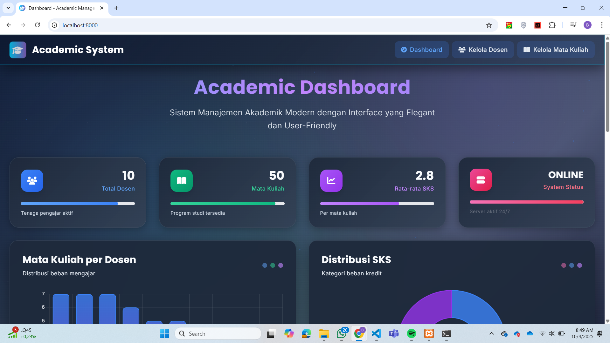
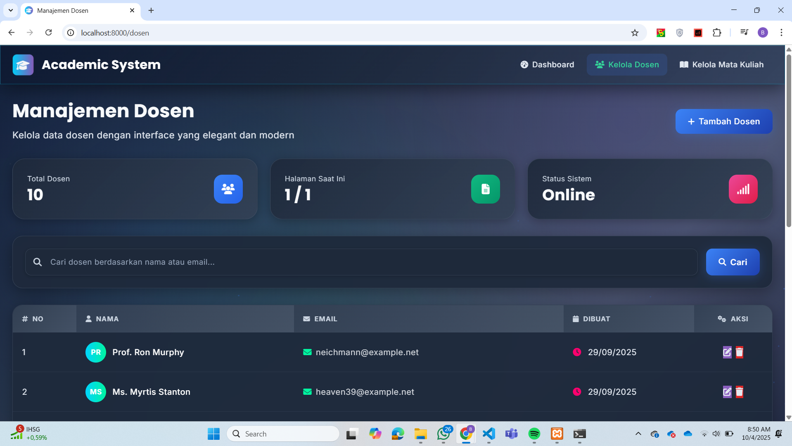
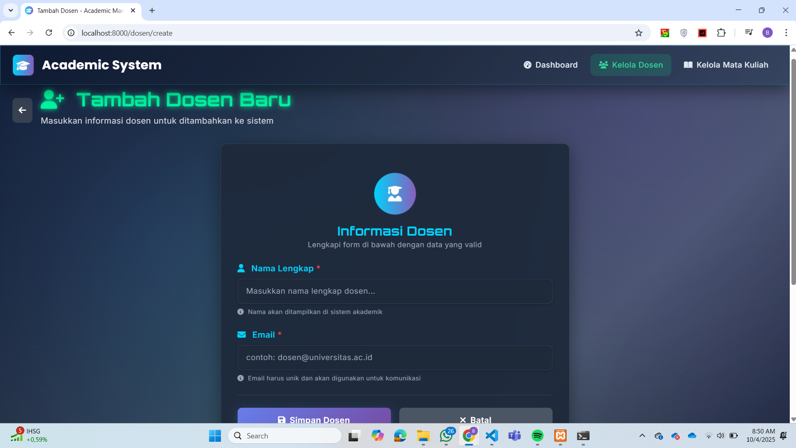
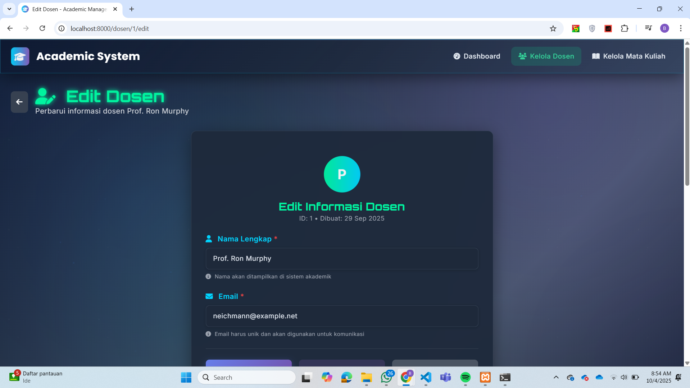
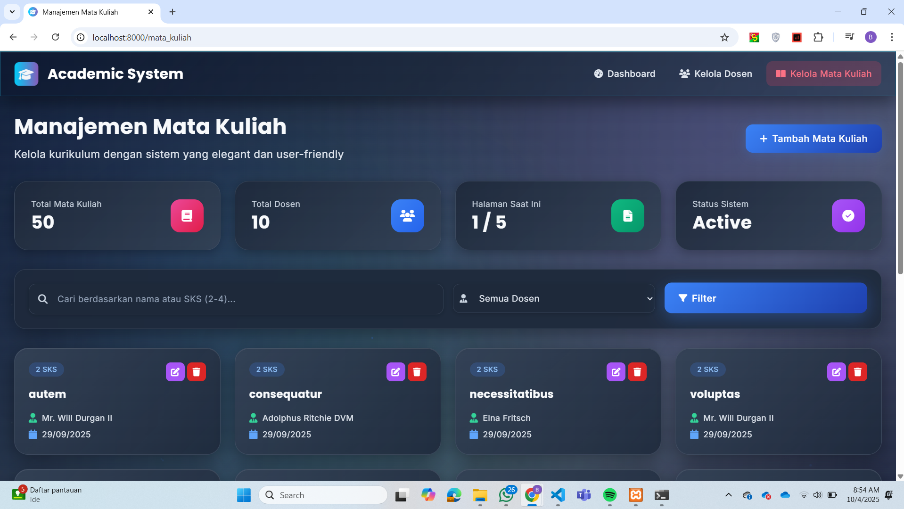
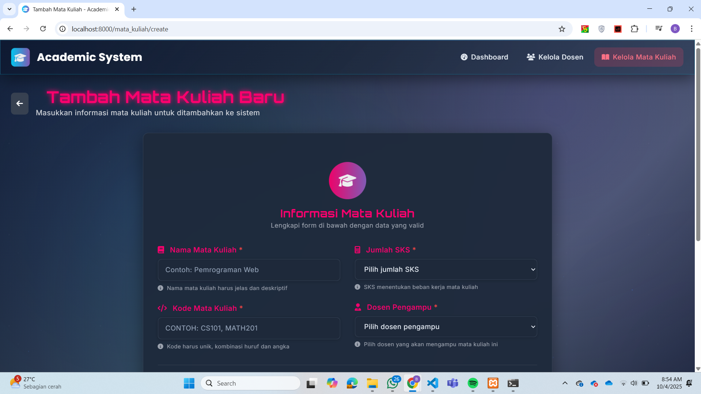
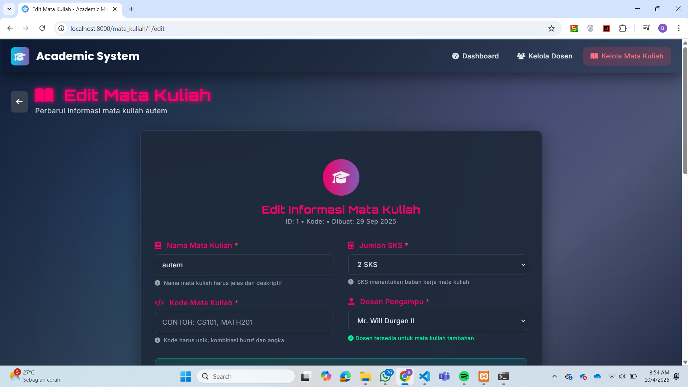

# 🎓 Academic Management System

<div align="center">


**Sistem Manajemen Akademik Modern dengan Desain Futuristik**

*Mengelola data dosen dan mata kuliah dengan teknologi terdepan dan user interface yang elegan*

[🚀 Demo](#-demo) • [📦 Instalasi](#-instalasi) • [🛠 Fitur](#-fitur) • [📱 Screenshots](#-screenshots)

</div>

---

## 📋 Daftar Isi

- [Overview](#-overview)
- [Fitur Utama](#-fitur-utama)
- [Teknologi yang Digunakan](#-teknologi-yang-digunakan)
- [Persyaratan Sistem](#-persyaratan-sistem)
- [Instalasi](#-instalasi)
- [Konfigurasi](#-konfigurasi)
- [Penggunaan](#-penggunaan)
- [API Documentation](#-api-documentation)
- [Screenshots](#-screenshots)
- [Contributing](#-contributing)
- [License](#-license)

---

## 🌟 Overview

**Academic Management System** adalah aplikasi web modern yang dirancang untuk mengelola data akademik dengan fokus pada manajemen dosen dan mata kuliah. Sistem ini menggabungkan fungsionalitas CRUD yang komprehensif dengan desain user interface yang futuristik dan elegan.

### ✨ Keunggulan

- 🎨 **Desain Futuristik**: Interface dengan tema cyber-punk dan animasi modern
- ⚡ **Performa Tinggi**: Dibangun dengan Laravel 11 dan optimasi database
- 📱 **Responsive Design**: Tampilan optimal di semua perangkat
- 🔍 **Advanced Search**: Pencarian dan filter yang powerful
- 📊 **Dashboard Analytics**: Visualisasi data dengan Chart.js
- 🚀 **User Experience**: Interaksi yang smooth dan intuitif

---

## 🛠 Fitur Utama

### 👨‍🏫 Manajemen Dosen
- ✅ **CRUD Lengkap**: Create, Read, Update, Delete data dosen
- 🔍 **Advanced Search**: Pencarian berdasarkan nama dan email dengan auto-complete
- 📊 **Statistics**: Jumlah mata kuliah per dosen dengan visualisasi
- 📝 **Validation**: Validasi email format dan data unik real-time
- 📋 **Enhanced Pagination**: 12 dosen per halaman dengan navigasi yang kontras tinggi

### 📚 Manajemen Mata Kuliah
- ✅ **CRUD Lengkap**: Manajemen data mata kuliah komprehensif
- 🔍 **Unified Search**: Pencarian cerdas berdasarkan nama mata kuliah atau SKS (2-4)
- 🎯 **Smart Filtering**: Deteksi otomatis input numerik untuk filter SKS
- 📊 **Visual Cards**: Grid layout dengan 12 kartu per halaman
- 🔗 **Relasi Data**: Keterkaitan dengan data dosen pengampu
- ⚡ **Optimized Pagination**: Maksimal 12 mata kuliah per halaman untuk efisiensi layout

### 📈 Dashboard & Analytics
- 📊 **Interactive Charts**: Grafik mata kuliah per dosen dengan Chart.js
- 📈 **SKS Distribution**: Visualisasi distribusi SKS
- 📋 **Statistics Cards**: Overview statistik sistem
- ⏰ **Recent Activity**: Aktivitas terbaru mata kuliah
- 🚀 **Quick Actions**: Shortcut untuk aksi cepat

### 🎨 UI/UX Features
- 🌟 **Elegant Dark Theme**: Desain futuristik dengan kontras tinggi untuk readability
- ✨ **Enhanced Animations**: Particle system, glow effects, dan transisi halus
- 📱 **Mobile Responsive**: Layout grid adaptif untuk semua ukuran layar
- 🔔 **Flash Messages**: Notifikasi sukses/error dengan gradient dan animasi
- 🎯 **Smart Form Validation**: Real-time validation dengan feedback visual interaktif
- 🎨 **High Contrast Pagination**: Tombol navigasi dengan visibility optimal pada dark theme
- 💫 **Interactive Elements**: Hover effects dengan transform dan shadow yang dinamis

---

## 🔧 Teknologi yang Digunakan

### Backend
- **Laravel 11** - PHP Framework terbaru
- **PHP 8.2+** - Server-side scripting
- **MySQL 8.0** - Database management
- **Eloquent ORM** - Database abstraction

### Frontend
- **Tailwind CSS 3.0** - Utility-first CSS framework
- **JavaScript ES6+** - Modern JavaScript
- **Chart.js** - Data visualization
- **Font Awesome 6** - Icon library
- **Google Fonts** - Typography (Orbitron)

### Tools & Utilities
- **Composer** - PHP dependency manager
- **npm/Node.js** - JavaScript package manager
- **Vite** - Build tool dan dev server
- **Git** - Version control

---

## 💻 Persyaratan Sistem

### Server Requirements
- **PHP**: 8.2 atau lebih tinggi
- **Database**: MySQL 8.0 / MariaDB 10.3+ / PostgreSQL 13.0+
- **Extensions**: 
  - OpenSSL PHP Extension
  - PDO PHP Extension
  - Mbstring PHP Extension
  - Tokenizer PHP Extension
  - XML PHP Extension
  - Ctype PHP Extension
  - JSON PHP Extension
  - BCMath PHP Extension

### Development Tools
- **Composer**: 2.0+
- **Node.js**: 18.0+
- **npm**: 8.0+

---

## 📦 Instalasi

### 1. Clone Repository

```bash
git clone https://github.com/bnrpmbd/academic-management-system.git
cd academic-management-system
```

### 2. Install Dependencies

```bash
# Install PHP dependencies
composer install

# Install JavaScript dependencies
npm install
```

### 3. Environment Setup

```bash
# Copy environment file
cp .env.example .env

# Generate application key
php artisan key:generate
```

### 4. Database Setup & Configuration

#### 4.1. Create Database (jika belum ada)

```bash
# Login ke MySQL
mysql -u root -p

# Create database
CREATE DATABASE academic_system;
exit;
```

#### 4.2. Konfigurasi Database

Edit file `.env` dan sesuaikan konfigurasi database:

```env
DB_CONNECTION=mysql
DB_HOST=127.0.0.1
DB_PORT=3306
DB_DATABASE=academic_system
DB_USERNAME=your_username
DB_PASSWORD=your_password
```

#### 4.3. Clear Configuration Cache

```bash
php artisan config:clear
```

#### 4.4. Generate Models (jika belum ada)

```bash
# Buat model Dosen dengan migration, factory, dan seeder
php artisan make:model Dosen -m -f -s

# Buat model MataKuliah dengan migration, factory, dan seeder
php artisan make:model MataKuliah -m -f -s
```

#### 4.5. Edit Model Files (jika belum ada isinya)

**app/Models/Dosen.php:**
```php
<?php

namespace App\Models;

use Illuminate\Database\Eloquent\Factories\HasFactory;
use Illuminate\Database\Eloquent\Model;

class Dosen extends Model
{
    use HasFactory;

    protected $fillable = ['nama', 'email'];

    public function mataKuliahs()
    {
        return $this->hasMany(MataKuliah::class);
    }
}
```

**app/Models/MataKuliah.php:**
```php
<?php

namespace App\Models;

use Illuminate\Database\Eloquent\Factories\HasFactory;
use Illuminate\Database\Eloquent\Model;

class MataKuliah extends Model
{
    use HasFactory;

    protected $fillable = ['nama', 'sks', 'dosen_id'];

    public function dosen()
    {
        return $this->belongsTo(Dosen::class);
    }
}
```

#### 4.6. Edit Migration Files (jika belum ada)

**database/migrations/xxxx_create_dosens_table.php:**
```php
<?php

use Illuminate\Database\Migrations\Migration;
use Illuminate\Database\Schema\Blueprint;
use Illuminate\Support\Facades\Schema;

return new class extends Migration
{
    public function up(): void
    {
        Schema::create('dosens', function (Blueprint $table) {
            $table->id();
            $table->string('nama', 100);
            $table->string('email')->unique();
            $table->timestamps();
        });
    }

    public function down(): void
    {
        Schema::dropIfExists('dosens');
    }
};
```

**database/migrations/xxxx_create_mata_kuliahs_table.php:**
```php
<?php

use Illuminate\Database\Migrations\Migration;
use Illuminate\Database\Schema\Blueprint;
use Illuminate\Support\Facades\Schema;

return new class extends Migration
{
    public function up(): void
    {
        Schema::create('mata_kuliahs', function (Blueprint $table) {
            $table->id();
            $table->string('nama', 100);
            $table->integer('sks');
            $table->foreignId('dosen_id')->constrained('dosens')->onDelete('cascade');
            $table->timestamps();
        });
    }

    public function down(): void
    {
        Schema::dropIfExists('mata_kuliahs');
    }
};
```

#### 4.7. Edit Factory Files (jika belum ada)

**database/factories/DosenFactory.php:**
```php
<?php

namespace Database\Factories;

use Illuminate\Database\Eloquent\Factories\Factory;

class DosenFactory extends Factory
{
    public function definition(): array
    {
        return [
            'nama' => $this->faker->name(),
            'email' => $this->faker->unique()->safeEmail(),
        ];
    }
}
```

**database/factories/MataKuliahFactory.php:**
```php
<?php

namespace Database\Factories;

use App\Models\Dosen;
use Illuminate\Database\Eloquent\Factories\Factory;

class MataKuliahFactory extends Factory
{
    public function definition(): array
    {
        return [
            'nama' => $this->faker->randomElement([
                'Algoritma dan Pemrograman',
                'Basis Data',
                'Jaringan Komputer',
                'Sistem Operasi',
                'Rekayasa Perangkat Lunak',
                'Matematika Diskrit',
                'Struktur Data',
                'Pemrograman Web'
            ]),
            'sks' => $this->faker->randomElement([2, 3, 4]),
            'dosen_id' => Dosen::factory(),
        ];
    }
}
```

#### 4.8. Edit Seeder Files (jika belum ada)

**database/seeders/DosenSeeder.php:**
```php
<?php

namespace Database\Seeders;

use App\Models\Dosen;
use Illuminate\Database\Seeder;

class DosenSeeder extends Seeder
{
    public function run(): void
    {
        Dosen::factory(10)->create();
    }
}
```

**database/seeders/MataKuliahSeeder.php:**
```php
<?php

namespace Database\Seeders;

use App\Models\MataKuliah;
use Illuminate\Database\Seeder;

class MataKuliahSeeder extends Seeder
{
    public function run(): void
    {
        MataKuliah::factory(50)->create();
    }
}
```

**database/seeders/DatabaseSeeder.php:**
```php
<?php

namespace Database\Seeders;

use Illuminate\Database\Seeder;

class DatabaseSeeder extends Seeder
{
    public function run(): void
    {
        $this->call([
            DosenSeeder::class,
            MataKuliahSeeder::class,
        ]);
    }
}
```

#### 4.9. Run Migration & Seeding

```bash
# Clear config cache
php artisan config:clear

# Run fresh migration with seeding
php artisan migrate:fresh --seed
```

### 5. Generate Controllers & Routes

#### 5.1. Generate Controllers (jika belum ada)

```bash
# Buat DosenController dengan resource methods
php artisan make:controller DosenController --resource

# Buat MataKuliahController dengan resource methods
php artisan make:controller MataKuliahController --resource
```

#### 5.2. Edit Routes

**routes/web.php:**
```php
<?php

use App\Http\Controllers\DosenController;
use App\Http\Controllers\MataKuliahController;
use Illuminate\Support\Facades\Route;

Route::get('/', function () {
    return view('dashboard');
})->name('dashboard');

Route::get('/dashboard', function () {
    return view('dashboard');
})->name('dashboard');

Route::resource('dosen', DosenController::class);
Route::resource('mata_kuliah', MataKuliahController::class);
```

#### 5.3. Edit Controller Files

**app/Http/Controllers/DosenController.php:**
```php
<?php

namespace App\Http\Controllers;

use App\Models\Dosen;
use Illuminate\Http\Request;

class DosenController extends Controller
{
    public function index(Request $request)
    {
        $q = $request->query('q');
        $items = Dosen::query()
            ->when($q, function ($query) use ($q) {
                $query->where(function ($sub) use ($q) {
                    $sub->where('nama', 'like', "%{$q}%")
                        ->orWhere('email', 'like', "%{$q}%");
                });
            })
            ->latest()
            ->paginate(12)
            ->withQueryString();

        return view('dosen.index', compact('items', 'q'));
    }

    public function create()
    {
        return view('dosen.create');
    }

    public function store(Request $request)
    {
        $data = $request->validate([
            'nama' => 'required|string|max:100',
            'email' => 'required|email|unique:dosens,email',
        ]);

        Dosen::create($data);
        return redirect()->route('dosen.index')->with('ok','Dosen berhasil dibuat.');
    }

    public function show(Dosen $dosen)
    {
        $dosen->load('mataKuliahs');
        return view('dosen.show', compact('dosen'));
    }

    public function edit(Dosen $dosen)
    {
        return view('dosen.edit', compact('dosen'));
    }

    public function update(Request $request, Dosen $dosen)
    {
        $data = $request->validate([
            'nama' => 'required|string|max:100',
            'email' => 'required|email|unique:dosens,email,' . $dosen->id,
        ]);

        $dosen->update($data);
        return redirect()->route('dosen.index')->with('ok','Dosen berhasil diperbarui.');
    }

    public function destroy(Dosen $dosen)
    {
        $dosen->delete();
        return redirect()->route('dosen.index')->with('ok','Dosen berhasil dihapus.');
    }
}
```

**app/Http/Controllers/MataKuliahController.php:**
```php
<?php

namespace App\Http\Controllers;

use App\Models\MataKuliah;
use App\Models\Dosen;
use Illuminate\Http\Request;

class MataKuliahController extends Controller
{
    public function index(Request $request)
    {
        $q = $request->query('q');
        $dosen_id = $request->query('dosen_id');

        $items = MataKuliah::with('dosen')
            ->when($q, function($query) use ($q) {
                if (is_numeric($q) && in_array($q, [2, 3, 4])) {
                    $query->where('sks', $q);
                } else {
                    $query->where('nama', 'like', "%{$q}%");
                }
            })
            ->when($dosen_id, fn($qr) => $qr->where('dosen_id',$dosen_id))
            ->latest()
            ->paginate(12)
            ->withQueryString();

        $dosens = Dosen::orderBy('nama')->get(['id','nama']);
        
        return view('mata_kuliah.index',
        compact('items','q','dosen_id','dosens'));
    }

    public function create()
    {
        $dosens = Dosen::orderBy('nama')->get(['id','nama']);
        return view('mata_kuliah.create', compact('dosens'));
    }

    public function store(Request $request)
    {
        $data = $request->validate([
            'nama' => 'required|string|max:100',
            'sks' => 'required|integer|min:2|max:4',
            'dosen_id' => 'required|exists:dosens,id',
        ]);

        MataKuliah::create($data);
        return redirect()->route('mata_kuliah.index')->with('ok','Mata kuliah berhasil dibuat.');
    }

    public function show(MataKuliah $mataKuliah)
    {
        $mataKuliah->load('dosen');
        return view('mata_kuliah.show', compact('mataKuliah'));
    }

    public function edit(MataKuliah $mataKuliah)
    {
        $dosens = Dosen::orderBy('nama')->get(['id','nama']);
        return view('mata_kuliah.edit', compact('mataKuliah', 'dosens'));
    }

    public function update(Request $request, MataKuliah $mataKuliah)
    {
        $data = $request->validate([
            'nama' => 'required|string|max:100',
            'sks' => 'required|integer|min:2|max:4',
            'dosen_id' => 'required|exists:dosens,id',
        ]);

        $mataKuliah->update($data);
        return redirect()->route('mata_kuliah.index')->with('ok','Mata kuliah berhasil diperbarui.');
    }

    public function destroy(MataKuliah $mataKuliah)
    {
        $mataKuliah->delete();
        return redirect()->route('mata_kuliah.index')->with('ok','Mata kuliah berhasil dihapus.');
    }
}
```

### 6. Create Blade Views

#### 6.1. Create View Directories

```bash
# Buat direktori untuk views
mkdir resources/views/dosen
mkdir resources/views/mata_kuliah
```

#### 6.2. Create Layout File

**resources/views/layouts/app.blade.php** - Layout utama dengan dark theme dan navigation

#### 6.3. Create Blade Files

**Dosen Views:**
- `resources/views/dosen/index.blade.php` - List dosen dengan search dan pagination
- `resources/views/dosen/create.blade.php` - Form tambah dosen
- `resources/views/dosen/edit.blade.php` - Form edit dosen
- `resources/views/dosen/show.blade.php` - Detail dosen dengan mata kuliah

**Mata Kuliah Views:**
- `resources/views/mata_kuliah/index.blade.php` - Grid mata kuliah dengan unified search
- `resources/views/mata_kuliah/create.blade.php` - Form tambah mata kuliah
- `resources/views/mata_kuliah/edit.blade.php` - Form edit mata kuliah
- `resources/views/mata_kuliah/show.blade.php` - Detail mata kuliah

**Dashboard:**
- `resources/views/dashboard.blade.php` - Dashboard dengan analytics dan charts

### 7. Build Assets

```bash
# Build for development
npm run dev

# Or build for production
npm run build
```

### 8. Start Development Server

```bash
php artisan serve
```

Aplikasi akan berjalan di `http://localhost:8000`

### 9. Setup Screenshots Folder (Optional)

```bash
# Buat folder untuk screenshots demo
mkdir screenshots

```

---

## ⚙️ Konfigurasi

### Database Seeder

Sistem dilengkapi dengan seeder untuk data sample:

```bash
# Generate 10 dosen dan 50 mata kuliah
php artisan db:seed

# Atau jalankan seeder spesifik
php artisan db:seed --class=DosenSeeder
php artisan db:seed --class=MataKuliahSeeder
```

### Environment Variables

Konfigurasi penting di file `.env`:

```env
# Application
APP_NAME="Academic Management System"
APP_ENV=local
APP_DEBUG=true
APP_URL=http://localhost:8000

# Database
DB_CONNECTION=mysql
DB_HOST=127.0.0.1
DB_PORT=3306
DB_DATABASE=academic_system
DB_USERNAME=root
DB_PASSWORD=

# Cache & Session
CACHE_DRIVER=file
SESSION_DRIVER=file
SESSION_LIFETIME=120

# Queue
QUEUE_CONNECTION=sync
```

---

## 🎯 Penggunaan

### Dashboard
- Akses dashboard di route `/dashboard`
- Lihat statistik sistem secara keseluruhan
- Gunakan quick actions untuk aksi cepat
- Monitor aktivitas terbaru

### Manajemen Dosen
- **List Dosen**: `/dosen` - Melihat semua dosen dengan pagination
- **Tambah Dosen**: `/dosen/create` - Form tambah dosen baru
- **Detail Dosen**: `/dosen/{id}` - Informasi lengkap dosen
- **Edit Dosen**: `/dosen/{id}/edit` - Form edit data dosen
- **Search**: Gunakan form pencarian untuk cari dosen

### Manajemen Mata Kuliah
- **List Mata Kuliah**: `/mata-kuliah` - Grid view 4 kolom dengan 12 kartu per halaman
- **Tambah Mata Kuliah**: `/mata-kuliah/create` - Form tambah dengan icon dan validasi
- **Detail Mata Kuliah**: `/mata-kuliah/{id}` - Informasi lengkap dengan relasi dosen
- **Edit Mata Kuliah**: `/mata-kuliah/{id}/edit` - Form edit dengan pre-filled data
- **Unified Search**: Pencarian cerdas - ketik nama atau angka SKS (2,3,4) di satu field
- **Enhanced Pagination**: Navigasi halaman dengan kontras tinggi dan hover effects

### Validasi Data
- **Email Dosen**: Format email valid dan unik dengan real-time checking
- **Nama Mata Kuliah**: Tidak boleh kosong, minimal 3 karakter, maksimal 100 karakter
- **SKS**: Hanya nilai 2, 3, atau 4 (dropdown validation)
- **Dosen**: Harus memilih dari dosen yang tersedia (foreign key constraint)
- **Search Input**: Auto-detect numerik (2-4) untuk SKS atau text untuk nama

---

## 📊 API Documentation

### Dosen Endpoints

```bash
GET    /dosen                 # List semua dosen
POST   /dosen                 # Create dosen baru
GET    /dosen/{id}            # Show dosen spesifik
PUT    /dosen/{id}            # Update dosen
DELETE /dosen/{id}            # Delete dosen
```

### Mata Kuliah Endpoints

```bash
GET    /mata-kuliah           # List semua mata kuliah
POST   /mata-kuliah           # Create mata kuliah baru
GET    /mata-kuliah/{id}      # Show mata kuliah spesifik
PUT    /mata-kuliah/{id}      # Update mata kuliah
DELETE /mata-kuliah/{id}      # Delete mata kuliah
```

### Dashboard Endpoints

```bash
GET    /dashboard             # Dashboard utama
GET    /api/dashboard/stats   # API statistik dashboard
```

### Query Parameters

```bash
# Search & Filter
?q=keyword               # Unified search (nama atau SKS)
?q=2                     # Search mata kuliah dengan 2 SKS
?q=Matematika           # Search mata kuliah dengan nama mengandung "Matematika"
?dosen_id=1             # Filter by dosen ID
?page=2                 # Pagination (12 items per page)
```

### Smart Search Examples

```bash
# Pencarian berdasarkan nama
/mata-kuliah?q=Algoritma

# Pencarian berdasarkan SKS
/mata-kuliah?q=3         # Menampilkan semua mata kuliah 3 SKS

# Kombinasi filter
/mata-kuliah?q=2&dosen_id=1  # Mata kuliah 2 SKS dari dosen tertentu
```

---

## 📱 Demo Screenshots

### 🏠 Dashboard
<div align="center">


*Dashboard dengan statistik real-time, chart interaktif, dan quick actions*

</div>

### 👨‍🏫 Manajemen Dosen

<div align="center">


*List dosen dengan advanced search dan enhanced pagination*


*Form tambah dosen dengan validasi real-time*


*Form edit dosen dengan validasi real-time*

</div>

### 📚 Manajemen Mata Kuliah

<div align="center">


*Grid layout mata kuliah dengan unified search (nama atau SKS)*


*Form tambah mata kuliah dengan dropdown dosen dan SKS validation*


*Form edit mata kuliah dengan dropdown dosen dan SKS validation*

</div>


> **📝 Note**: Untuk melihat demo live, clone repository ini dan ikuti [panduan instalasi](#-instalasi) di atas.

---

## 🚀 Deployment

### Production Build

```bash
# Build assets untuk production
npm run build

# Optimize Laravel
php artisan config:cache
php artisan route:cache
php artisan view:cache

# Set proper permissions
chmod -R 755 storage bootstrap/cache
```

### Environment Production

```env
APP_ENV=production
APP_DEBUG=false
APP_URL=https://yourdomain.com

# Use production database
DB_HOST=your-production-host
DB_DATABASE=your-production-db
```

---

## 🧪 Testing

```bash
# Run semua test
php artisan test

# Test specific feature
php artisan test --filter DosenTest

# Test dengan coverage
php artisan test --coverage
```

---

## 🔧 Troubleshooting

### Common Issues

1. **Migration Error**
   ```bash
   php artisan migrate:fresh --seed
   ```

2. **Permission Issues**
   ```bash
   chmod -R 775 storage bootstrap/cache
   ```

3. **Asset Building Error**
   ```bash
   npm cache clean --force
   npm install
   npm run build
   ```

4. **Database Connection**
   - Pastikan MySQL service berjalan
   - Periksa credentials di `.env`
   - Test koneksi: `php artisan tinker` → `DB::connection()->getPdo()`

---

## 🤝 Contributing

Kami welcome kontribusi dari komunitas! Silakan ikuti panduan berikut:

### Development Workflow

1. **Fork** repository ini
2. **Create** feature branch (`git checkout -b feature/AmazingFeature`)
3. **Commit** changes (`git commit -m 'Add some AmazingFeature'`)
4. **Push** branch (`git push origin feature/AmazingFeature`)
5. **Open** Pull Request

### Coding Standards

- Ikuti **PSR-12** untuk PHP
- Gunakan **ESLint** untuk JavaScript
- **Comment** code yang kompleks
- **Test** semua fitur baru
- **Update** documentation jika diperlukan

### Bug Reports

Gunakan [GitHub Issues](https://github.com/bnrpmbd/crud-app/issues) untuk melaporkan bug dengan format:

- **Deskripsi**: Jelaskan bug secara detail
- **Steps to Reproduce**: Langkah-langkah reproduce
- **Expected Behavior**: Behavior yang diharapkan
- **Screenshots**: Sertakan screenshot jika perlu
- **Environment**: OS, Browser, PHP version

---

## 📝 Changelog

### Version 1.2.0 (2025-09-29)
- 🔍 **Unified Search**: Smart search untuk mata kuliah (nama atau SKS dalam satu field)
- 📋 **Enhanced Pagination**: 12 items per page dengan high contrast navigation
- 🎨 **Improved Dark Theme**: Better text contrast dan visibility
- ✨ **Interactive Elements**: Enhanced hover effects dan animations
- 🚀 **Performance**: Optimized queries dan better UX

### Version 1.1.0 (2025-09-28)
- 🌟 **Dark Theme**: Elegant dark theme dengan futuristic elements
- 💫 **Particle System**: Background animations untuk atmosphere
- 🎯 **Smart Validation**: Real-time form validation
- 📊 **Chart Integration**: Dashboard analytics dengan Chart.js

### Version 1.0.0 (2025-09-27)
- ✨ Initial release dengan Laravel 11
- 🎨 Futuristic UI design dengan Tailwind CSS
- 👨‍🏫 Complete dosen management (CRUD + search)
- 📚 Complete mata kuliah management (CRUD + filtering)
- 📊 Interactive dashboard dengan statistics
- 📱 Mobile responsive design

---

## 📄 License

Project ini dilisensikan under **MIT License** - lihat file [LICENSE](LICENSE) untuk detail.

```
MIT License

Copyright (c) 2024 Academic Management System

Permission is hereby granted, free of charge, to any person obtaining a copy
of this software and associated documentation files (the "Software"), to deal
in the Software without restriction, including without limitation the rights
to use, copy, modify, merge, publish, distribute, sublicense, and/or sell
copies of the Software, and to permit persons to whom the Software is
furnished to do so, subject to the following conditions:

The above copyright notice and this permission notice shall be included in all
copies or substantial portions of the Software.
```

---

## 👨‍💻 Author

**Banar Pambudi**
- GitHub: [@bnrpmbd](https://github.com/bnrpmbd)
- Email: banarpambudi094@gmail.com
- LinkedIn: https://linkedin.com/in/banarpambudi

---

## 🙏 Acknowledgments

- [Laravel](https://laravel.com) - PHP Framework
- [Tailwind CSS](https://tailwindcss.com) - CSS Framework
- [Chart.js](https://chartjs.org) - Data Visualization
- [Font Awesome](https://fontawesome.com) - Icons
- [Google Fonts](https://fonts.google.com) - Typography

---

## 📞 Support

Jika Anda memiliki pertanyaan atau membutuhkan bantuan:

- 📧 Email: support@academic-system.com
- 💬 Discord: [Join Server](https://discord.gg/academic-system)
- 📖 Documentation: [Wiki](https://github.com/bnrpmbd/academic-management-system/wiki)
- 🐛 Issues: [GitHub Issues](https://github.com/bnrpmbd/academic-management-system/issues)

---

<div align="center">

**⭐ Jangan lupa berikan star jika project ini membantu Anda! ⭐**

*Made with ❤️ for better academic management*

</div>

## About Laravel

Laravel is a web application framework with expressive, elegant syntax. We believe development must be an enjoyable and creative experience to be truly fulfilling. Laravel takes the pain out of development by easing common tasks used in many web projects, such as:

- [Simple, fast routing engine](https://laravel.com/docs/routing).
- [Powerful dependency injection container](https://laravel.com/docs/container).
- Multiple back-ends for [session](https://laravel.com/docs/session) and [cache](https://laravel.com/docs/cache) storage.
- Expressive, intuitive [database ORM](https://laravel.com/docs/eloquent).
- Database agnostic [schema migrations](https://laravel.com/docs/migrations).
- [Robust background job processing](https://laravel.com/docs/queues).
- [Real-time event broadcasting](https://laravel.com/docs/broadcasting).

Laravel is accessible, powerful, and provides tools required for large, robust applications.

## Learning Laravel

Laravel has the most extensive and thorough [documentation](https://laravel.com/docs) and video tutorial library of all modern web application frameworks, making it a breeze to get started with the framework.

You may also try the [Laravel Bootcamp](https://bootcamp.laravel.com), where you will be guided through building a modern Laravel application from scratch.

If you don't feel like reading, [Laracasts](https://laracasts.com) can help. Laracasts contains thousands of video tutorials on a range of topics including Laravel, modern PHP, unit testing, and JavaScript. Boost your skills by digging into our comprehensive video library.

## Laravel Sponsors

We would like to extend our thanks to the following sponsors for funding Laravel development. If you are interested in becoming a sponsor, please visit the [Laravel Partners program](https://partners.laravel.com).

### Premium Partners

- **[Vehikl](https://vehikl.com)**
- **[Tighten Co.](https://tighten.co)**
- **[Kirschbaum Development Group](https://kirschbaumdevelopment.com)**
- **[64 Robots](https://64robots.com)**
- **[Curotec](https://www.curotec.com/services/technologies/laravel)**
- **[DevSquad](https://devsquad.com/hire-laravel-developers)**
- **[Redberry](https://redberry.international/laravel-development)**
- **[Active Logic](https://activelogic.com)**

## Contributing

Thank you for considering contributing to the Laravel framework! The contribution guide can be found in the [Laravel documentation](https://laravel.com/docs/contributions).

## Code of Conduct

In order to ensure that the Laravel community is welcoming to all, please review and abide by the [Code of Conduct](https://laravel.com/docs/contributions#code-of-conduct).

## Security Vulnerabilities

If you discover a security vulnerability within Laravel, please send an e-mail to Taylor Otwell via [taylor@laravel.com](mailto:taylor@laravel.com). All security vulnerabilities will be promptly addressed.

## License

The Laravel framework is open-sourced software licensed under the [MIT license](https://opensource.org/licenses/MIT).
